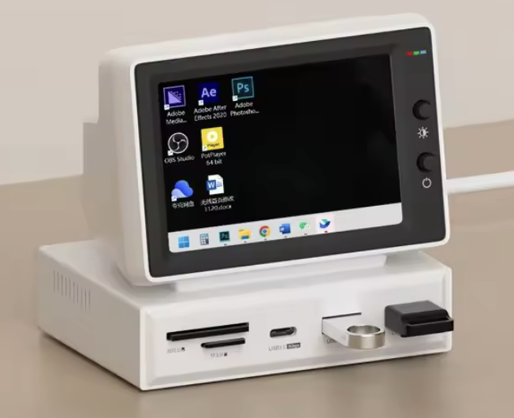

# Dashboards for Hagibis 3.5inch IPS Retro Display

These are some dashboards I made in html/css/js to display on my mini 3.5" display connected to a Mac Mini Server (2011).

Yes, I'm still using such an old Mac. And it's the only display I'm using, because I use the Mac as a local multimedia/file server.

The display looks like this and it's 3.5" with an IPS screen of an actual resolution of 480x320 (the monitor emulates higher resolutions for HDMI compatibility).

#

## Customization

Some dashboards can be customized, so please read README in each folder to learn how to do it.

## How To Display The Dashboard

You can use a project like [WebSavers](https://github.com/thinkyhead/WebSavers) to make a custom screensaver, but I'm using a different approach.

I created a standard user (non-admin/non-root) meant for displaying the dashboards. 
My Mac Mini stays logged in on that user. It doesn't go to sleep because I disabled all power saving options, so the display stays on and the user stays logged.

The browser I use for these dashboards is **Safari** - not because it's good, but because I can disable all toolbars (for that *seamless* look).

By default, Safari shows the upper toolbar when full screen, but I disabled it by using *View* > *Always Show Toolbar in Full Screen*.

### Mac Turns The Display Off After Ending Screen Sharing

If you don't have a physical mouse/keyboard plugged into the Mac (like I do) and you use screen sharing, you may encounter a situation when your Mac just disabled/locks the screen when you end screen sharing session.

To fix this, run this command as an admin user:
```sh
sudo defaults write /Library/Preferences/com.apple.RemoteManagement RestoreMachineState -bool NO
```

Your machine will keep the screen on.
